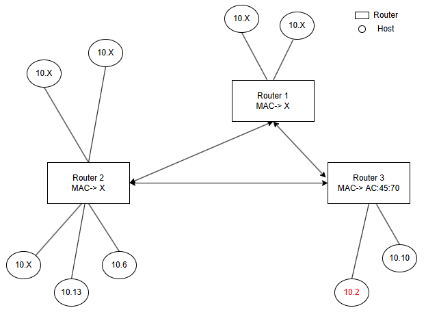
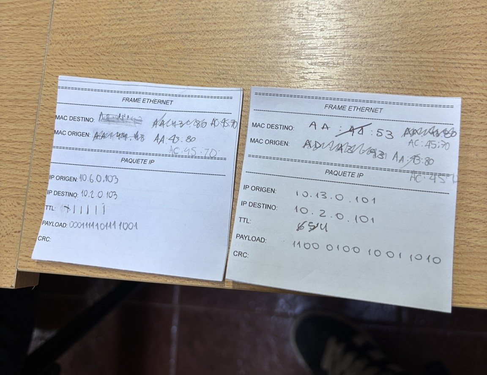
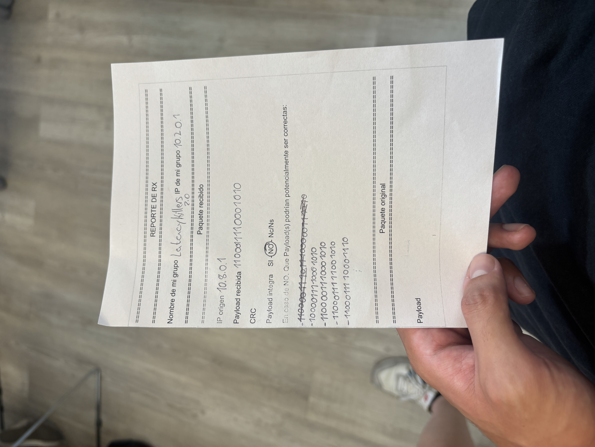

# Trabajo Práctico N°1 – Redes de Computadoras

## Integrantes
- Antonino, Tadeo - tadeo.antonino@mi.unc.edu.ar
- Quintana, Ignacio Agustin - ignacio.agustin.quintana@mi.unc.edu.ar
- Fioramonti, Martino - martino.fioramonti@mi.unc.edu.ar

## Fecha
*26/03/26*

---

# Parte 1: Simulación de envío de paquetes, ARP y ruteo

## Descripción general

En este trabajo práctico se simuló el envío de paquetes entre distintos hosts pertenecientes a diferentes redes. Para ello, se construyó una topología con múltiples LAN conectadas mediante routers, permitiendo observar el comportamiento del ruteo, la resolución ARP y el encapsulamiento de paquetes.

---

## Topología de red

Para la simulación usamos la siguiente topología:

---

## Ejemplos de transmisión de paquetes

Durante la práctica se observaron distintos envíos de paquetes dirigidos a nuestra red 10.2, uno fue exitoso y otro fallido.

En la imagen se pueden ver dos paquetes recibidos por la red destino.

En el primer caso, el paquete estaba dirigido a la IP 10.2.0.103. Si bien el paquete llegó a la red correspondiente, no existía ningún host con esa dirección IP, por lo que no pudo ser entregado. Esta situación generó un error de tipo "destination unreachable", simulando un comportamiento real de red ante destinos inexistentes.

En el segundo caso, el paquete enviado desde la IP 10.13.0.101 llegó correctamente al host 10.2.0.101, ya que dicha dirección existía dentro de la red. Esto permitió completar exitosamente la entrega del mensaje.

---

# Resolución de las preguntas

## a) Diferencia entre IP y MAC

La **dirección IP** es un identificador lógico que sirve para ubicar un dispositivo en una red y puede cambiar (similar a como funciona una dirección de una casa), mientras que la **dirección MAC** es un identificador físico único asignado al hardware de red (sería un DNI) que normalmente no cambia.

Durante el laboratorio se observó que la IP destino se mantiene constante porque indica el destino final del paquete, independientemente del camino que recorra. En cambio, la MAC destino cambia en cada salto, ya que corresponde al siguiente dispositivo dentro de la red local por donde se está enviando el paquete.

Esto muestra que la IP nos dice dónde está el dispositivo en la red global, mientras que la MAC indica a qué dispositivo se le debe entregar el paquete en cada enlace local.

---

## b) Uso del default gateway

El **default gateway** se usa cuando un dispositivo quiere enviar datos a una dirección IP que **no está dentro de su misma red local**. Como el host no sabe llegar directamente al destino, le entrega el paquete al gateway (generalmente un router), que actúa como intermediario y se encarga de **buscar la mejor ruta hacia otras redes**.

En lugar de intentar obtener la MAC del destino final, el host obtiene mediante ARP la MAC del gateway, ya que es el único dispositivo capaz de reenviar el paquete fuera de la red local.

En nuestra simulación, esto se representó cuando le entregábamos el paquete a los grupos del centro, que actuaban como routers, para que lo reenvíen por el camino correcto.

---

## c) Ruteo hop-by-hop

El **ruteo hop-by-hop** es el proceso por el cual un paquete de datos no conoce toda la ruta hasta su destino, sino que **va avanzando paso a paso**: cada router recibe el paquete, consulta su tabla de ruteo y decide cuál es el **siguiente hop**, y así sucesivamente hasta llegar al destino final.

Este modelo tiene varias ventajas, como que cada router solo necesita información local, lo que hace que la red sea más escalable y flexible. Además, permite adaptarse a cambios en la topología sin necesidad de recalcular rutas completas.

---

## d) Reencapsulación de frames

La **reencapsulación de frames** ocurre en cada salto de una red cuando un paquete llega a un router, este **quita el frame original**, analiza el paquete IP para decidir el siguiente destino, y luego **lo vuelve a encapsular en un nuevo frame** con las direcciones MAC correspondientes al siguiente salto. 

Esto es necesario porque las direcciones MAC solo son válidas dentro de una red local. Es decir, no se pueden usar las mismas direcciones físicas en distintas redes.

Si no se realizara este proceso, el frame no podría ser interpretado correctamente en la siguiente red, ya que las direcciones MAC dejarían de ser válidas.

---

## e) Función del TTL

El **TTL (Time To Live)** es un valor que lleva cada paquete IP para evitar que circule infinitamente por la red. Este valor **se decrementa en 1 en cada salto**, y cuando llega a 0, el paquete se descarta.

Su función principal es **prevenir bucles de ruteo** y evitar congestión en la red. Sin este mecanismo, un paquete podría quedar circulando indefinidamente en caso de errores, consumiendo recursos innecesariamente.

---

# Conclusión

Creemos que este tipo de simulación "analógica/física" es realmente muy intuitiva para ver y aprender como funcionan las redes reales, dado que nos permite seguir visualmente el camino entero que realiza un paquete desde su origen hasta su destino, y también nos permite ver que pasa en casos donde no hay tal destino. 
Pudimos aprender los conceptos de **default gateway**, **ruteo hop by hop**, **TTL**, **reencapsulación de frames** y la diferencia entre **IP** y **MAC**.

---

# Parte 2: Inyección y detección de errores

## Descripción general

En esta parte del trabajo práctico se simuló la introducción de errores en la transmisión de paquetes, con el objetivo de analizar mecanismos de detección y corrección de errores (EDAC).

Los routers intermedios (en este caso el profesor) podían modificar uno o más bits de la payload durante el reenvío, mientras que los hosts debían aplicar técnicas de detección al recibir los paquetes.

---

## Ejemplo de recepción con error

En nuestro caso, se recibió un paquete con la siguiente información:

- IP origen: 10.8.0.1  
- Payload recibida: 110001110001010  

Al aplicar el mecanismo de detección de errores (EDAC), se determinó que la payload **no era íntegra**, lo que indica que el paquete fue modificado durante la transmisión.

---

## Análisis del error

Durante la experiencia, se pudieron haber alterado uno o más bits de la payload. Para verificar la integridad, se utilizaron técnicas basadas en paridad/XOR. En nuestro grupo, nos toco enviar un paquete utilizando paridad. Luego recibimos un paquete con su EDAC y tuvimos que verificar su integridad con XOR.

La operación XOR (Exclusive OR) permite comparar bits de a pares. Su comportamiento es el siguiente:
- Si los bits son iguales, el resultado es 0
- Si los bits son distintos, el resultado es 1
  
Esta propiedad se utiliza para verificar la integridad de los datos. Al aplicar la operación XOR sobre la payload junto con su valor de control (por ejemplo, un checksum o código de verificación), se obtiene un resultado que debería ser 0 si los datos no fueron modificados.

El análisis realizado indicó que existía al menos un error en los datos recibidos.

---

## Intento de corrección

Dado que el método utilizado permite detectar errores pero no siempre corregirlos, se analizaron posibles variantes de la payload que podrían corresponder al mensaje original.

Algunas de las posibles correcciones evaluadas fueron:

- 100001110001010  
- 110000110001010  
- 110001111001010  
- 110001110001110  

Sin embargo, no fue posible determinar con certeza cuál de estas corresponde al mensaje original.

---

## Conclusión

A partir de este experimento se concluye que:

- Los mecanismos de EDAC permiten detectar errores en la transmisión de datos.
- No todos los métodos permiten corregir errores de manera unívoca.
- En presencia de múltiples posibles correcciones, no es posible garantizar cuál es el mensaje original sin información adicional.

Esto refleja situaciones reales en redes, donde ciertos mecanismos solo permiten la detección de errores, pero requieren retransmisión para recuperar la información correcta.