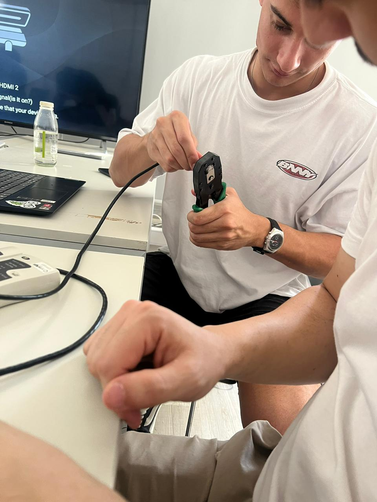
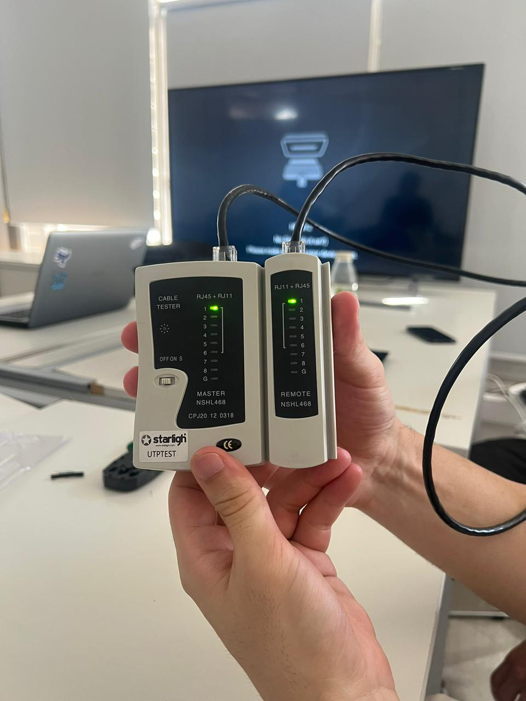
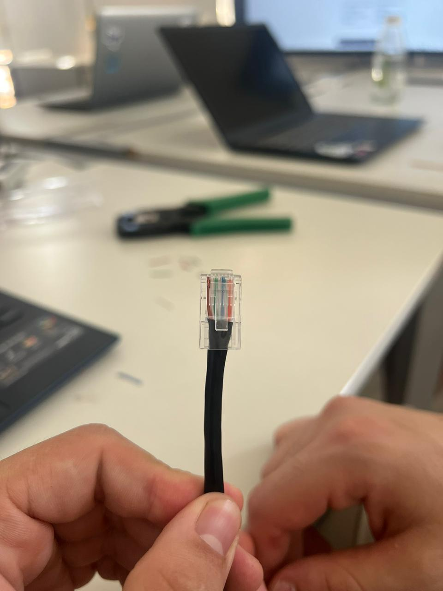
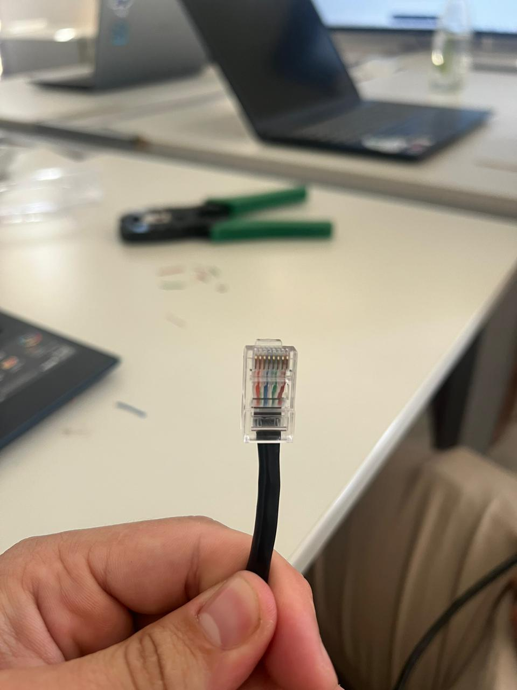
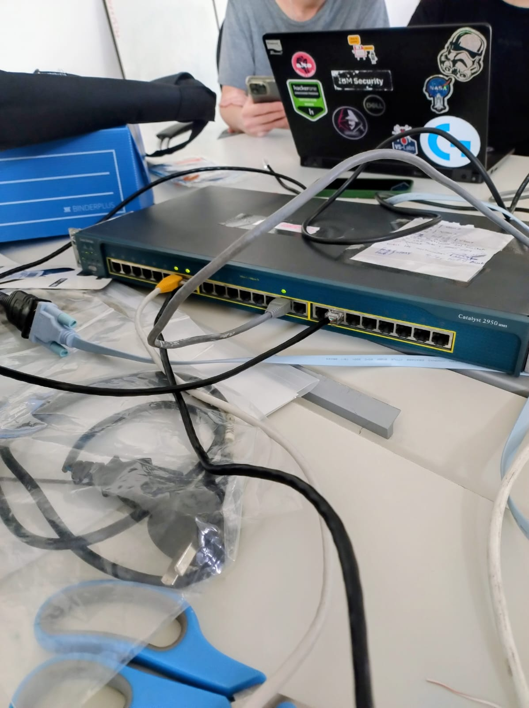
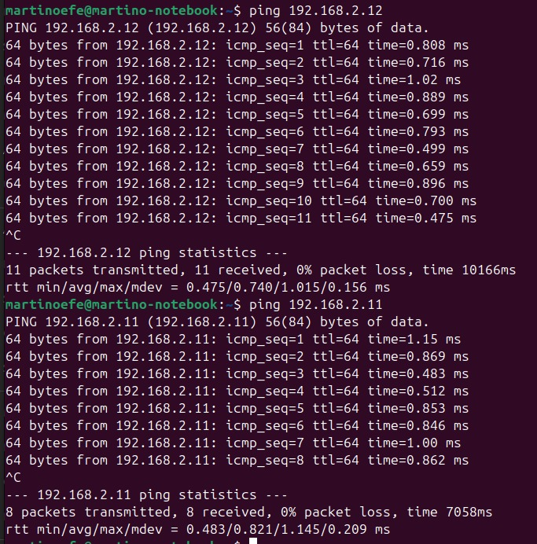
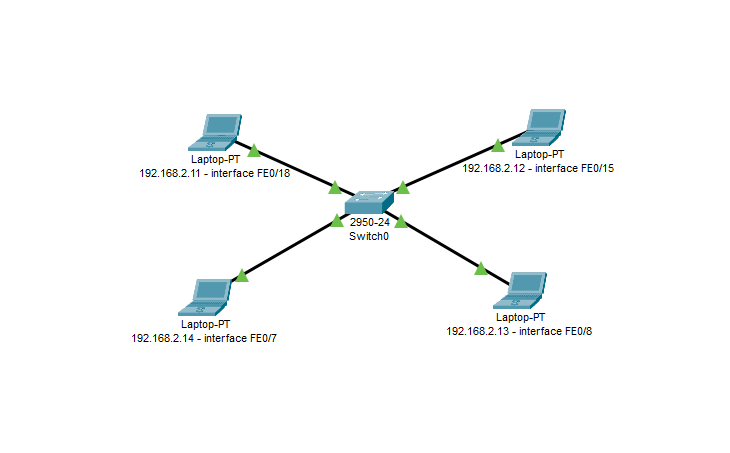

# Trabajo Práctico N°2 – Redes de Computadoras

## Integrantes

* Antonino, Tadeo - [tadeo.antonino@mi.unc.edu.ar](mailto:tadeo.antonino@mi.unc.edu.ar)
* Quintana, Ignacio Agustin - [ignacio.agustin.quintana@mi.unc.edu.ar](mailto:ignacio.agustin.quintana@mi.unc.edu.ar)
* Fioramonti, Martino - [martino.fioramonti@mi.unc.edu.ar](mailto:martino.fioramonti@mi.unc.edu.ar)

---

# Introducción

En este trabajo práctico se abordaron conceptos fundamentales de la capa física, mediante la construcción de cables de red y la configuración de un switch gestionable.

Se realizaron actividades prácticas que incluyeron el armado de cables Ethernet bajo norma T568A/B DERECHO, la verificación de su correcto funcionamiento, la conexión a un switch Cisco y la validación de la conectividad entre distintos equipos.

---

# Objetivos

* Adquirir experiencia en el armado de cables UTP.
* Verificar la correcta construcción de cables mediante herramientas específicas.
* Comprender la configuración básica de un switch.
* Analizar la conectividad entre dispositivos en una red local.
* Aplicar conceptos de direccionamiento IP y VLANs.

---

# Parte 1: Armado y verificación del cable UTP

## Descripción del proceso

Para la realización de esta parte del trabajo, se procedió al armado de un cable de red tipo **derecho (no cruzado)** bajo la norma T568.

Inicialmente, se investigaron los pasos necesarios para realizar correctamente el crimpado del cable. Luego, se siguió un tutorial para ejecutar el proceso.

## Pasos realizados

1. Corte del cable UTP a la longitud requerida.
2. Pelado de la cubierta externa.
3. Ordenamiento de los pares de cables según norma T568.
4. Inserción de los cables en el conector RJ45.
5. Crimpado utilizando pinza crimpeadora.

## Dificultades encontradas

Durante el proceso se presentaron dificultades principalmente en:

* El correcto orden de los cables.
* Lograr que todos los conductores lleguen al fondo del conector.
* Asegurar un buen contacto al crimpar.

Estas dificultades fueron resueltas revisando el procedimiento y repitiendo el armado hasta lograr un resultado correcto.

## Verificación del cable

Una vez armado el cable, se procedió a su verificación utilizando un **tester de cables de red**.

El resultado del test indicó que el cable estaba correctamente construido, ya que todos los pines presentaban continuidad adecuada.




## Intercambio y verificación con otro grupo

Según la consigna, se debía intercambiar el cable con otro grupo para realizar una verificación cruzada (inspección visual y test eléctrico) y documentar el proceso con fotografías.

En nuestro caso, debido a que en el momento de la práctica solo había dos grupos y con el objetivo de optimizar el tiempo disponible, no se realizó el intercambio de cables entre grupos.

## Autocrítica y mejoras

Como análisis crítico de nuestro propio cable, identificamos un aspecto a mejorar:

* Algunos conductores no llegaron completamente al fondo del conector RJ45 (quedaron levemente retraídos), lo que puede generar falsos contactos o fallas intermitentes en el futuro.

Para futuras prácticas, consideramos importante:

* Asegurar que todos los cables lleguen correctamente al tope del conector antes de crimpar.
* Verificar visualmente el alineamiento y profundidad de los conductores.

Este punto es clave para garantizar la calidad y confiabilidad del cableado.





---

# Parte 2: Configuración del switch y pruebas de conectividad

## Conexión al switch

Se utilizó un **switch Cisco Catalyst 2950** provisto por el laboratorio.

Para acceder a su configuración:

* Se conectó una computadora mediante cable serie (con adaptador USB).
* Se utilizó el software **PuTTY** para establecer la conexión.
* Se configuró la conexión a **9600 baudios**.

Una vez establecida la conexión, se inició sesión con las credenciales proporcionadas por el profesor.

## Análisis de la configuración

Se ejecutó el siguiente comando:

```bash
show running-config
```

Esto permitió visualizar la configuración actual del switch.

```
ip subnet-zero
!
!
spanning-tree mode pvst
no spanning-tree optimize bpdu transmission
spanning-tree extend system-id
!
!
!
!
interface FastEthernet0/1
!
interface FastEthernet0/2
!
interface FastEthernet0/3
!
interface FastEthernet0/4
!
interface FastEthernet0/5
!
interface FastEthernet0/6
!
interface FastEthernet0/7
 switchport access vlan 2
 switchport mode access
 spanning-tree portfast
!
interface FastEthernet0/8
 switchport access vlan 2
 switchport mode access
 spanning-tree portfast
!
interface FastEthernet0/9
!
interface FastEthernet0/10
 switchport access vlan 2
 switchport mode access
!
interface FastEthernet0/11
 switchport access vlan 2
 switchport mode access
!
interface FastEthernet0/12
 switchport mode trunk
!
interface FastEthernet0/13
!
interface FastEthernet0/14
!
interface FastEthernet0/15
 switchport access vlan 2
 switchport mode access
!
interface FastEthernet0/16
!
interface FastEthernet0/17
!
interface FastEthernet0/18
 switchport access vlan 2
 switchport mode access
!
interface FastEthernet0/19
!
interface FastEthernet0/20
!
interface FastEthernet0/21
!
interface FastEthernet0/22
!
interface FastEthernet0/23
!
interface FastEthernet0/24
!
interface Vlan1
 ip address 192.168.1.2 255.255.255.0
 no ip route-cache
 shutdown
!
interface Vlan2
 ip address 192.168.2.10 255.255.255.0
 no ip route-cache
!
ip default-gateway 192.168.1.1
ip http server
!
line con 0
line vty 0 4
 login
line vty 5 15
 login
!
!
!
monitor session 1 source interface Fa0/7 , Fa0/10
monitor session 1 destination interface Fa0/11
monitor session 2 destination interface Fa0/8
end
```

A partir del análisis se observó que:

* Existían dos VLANs configuradas:

  * VLAN 1
  * VLAN 2
* Varias interfaces ya estaban asignadas a la VLAN 2.
* Algunas interfaces estaban configuradas en modo access.

Debido a esto, se decidió reutilizar la configuración existente para ahorrar tiempo.

## Configuración de la red

Se conectaron un total de **4 computadoras**:

* 3 con Linux
* 1 con Windows

Se configuraron direcciones IP estáticas en la misma red:

* 192.168.2.11
* 192.168.2.12
* 192.168.2.13
* 192.168.2.14

Todas con máscara:

```bash
255.255.255.0
```

Y pertenecientes a la **VLAN 2**.



## Pruebas de conectividad

Se realizaron pruebas de conectividad utilizando el comando `ping` entre todas las computadoras.

### Resultados

* Todas las computadoras lograban comunicarse entre sí.
* Se verificó conectividad bidireccional.
* El tráfico circulaba correctamente a través del switch.

### Prueba de desconexión

Para validar el funcionamiento real de la red:

1. Se inició un ping continuo entre equipos.
2. Se desconectó físicamente el cable del switch.
3. Se observó que la comunicación se interrumpía.
4. Se reconectó el cable.
5. La comunicación se restableció correctamente.

Esto confirmó que:

* La conectividad dependía efectivamente del switch.
* El tráfico estaba siendo correctamente gestionado.

#### Salida de consola al desconectar cable:
```bash
C:\Users\ignac>ping -t 192.168.2.11

Haciendo ping a 192.168.2.11 con 32 bytes de datos:
Respuesta desde 192.168.2.11: bytes=32 tiempo=1ms TTL=64
Respuesta desde 192.168.2.11: bytes=32 tiempo=7ms TTL=64
Respuesta desde 192.168.2.11: bytes=32 tiempo=1ms TTL=64
Respuesta desde 192.168.2.11: bytes=32 tiempo=1ms TTL=64
Respuesta desde 192.168.2.11: bytes=32 tiempo=6ms TTL=64
Respuesta desde 192.168.2.11: bytes=32 tiempo=2ms TTL=64
Respuesta desde 192.168.2.11: bytes=32 tiempo=1ms TTL=64
Respuesta desde 192.168.2.11: bytes=32 tiempo=1ms TTL=64
Respuesta desde 192.168.2.11: bytes=32 tiempo=2ms TTL=64
Respuesta desde 192.168.2.11: bytes=32 tiempo=1ms TTL=64
Respuesta desde 192.168.2.11: bytes=32 tiempo=1ms TTL=64
Respuesta desde 192.168.2.11: bytes=32 tiempo=1ms TTL=64
Respuesta desde 192.168.2.11: bytes=32 tiempo=1ms TTL=64
Respuesta desde 192.168.2.11: bytes=32 tiempo=1ms TTL=64
Respuesta desde 192.168.2.11: bytes=32 tiempo=1ms TTL=64
Respuesta desde 192.168.2.11: bytes=32 tiempo=1ms TTL=64
Respuesta desde 192.168.2.11: bytes=32 tiempo=1ms TTL=64
Respuesta desde 192.168.2.11: bytes=32 tiempo=1ms TTL=64
Respuesta desde 192.168.2.11: bytes=32 tiempo=1ms TTL=64
Tiempo de espera agotado para esta solicitud.
Tiempo de espera agotado para esta solicitud.
Tiempo de espera agotado para esta solicitud.
Tiempo de espera agotado para esta solicitud.
Tiempo de espera agotado para esta solicitud.
Respuesta desde 192.168.2.14: Host de destino inaccesible.
Tiempo de espera agotado para esta solicitud.
Tiempo de espera agotado para esta solicitud.
Tiempo de espera agotado para esta solicitud.
Respuesta desde 192.168.2.11: bytes=32 tiempo=1ms TTL=64
Respuesta desde 192.168.2.11: bytes=32 tiempo=1ms TTL=64
Respuesta desde 192.168.2.11: bytes=32 tiempo=1ms TTL=64
Respuesta desde 192.168.2.11: bytes=32 tiempo=1ms TTL=64
Respuesta desde 192.168.2.11: bytes=32 tiempo=2ms TTL=64
Respuesta desde 192.168.2.11: bytes=32 tiempo=1ms TTL=64
Respuesta desde 192.168.2.11: bytes=32 tiempo=1ms TTL=64
Respuesta desde 192.168.2.11: bytes=32 tiempo=1ms TTL=64
Respuesta desde 192.168.2.11: bytes=32 tiempo=3ms TTL=64
Respuesta desde 192.168.2.11: bytes=32 tiempo=1ms TTL=64
Respuesta desde 192.168.2.11: bytes=32 tiempo=1ms TTL=64
```


#### Pings


#### Topología de Red



## Dificultades encontradas

Durante esta etapa se presentaron algunas dificultades:

* Conexión inicial al switch mediante consola.
* Comprensión del funcionamiento de VLANs.
* Entender que el switch no estaba asignado IPs a los dispositivos, sino que cada dispositivo tenia que configurar su propia IP fija.

Estas dificultades fueron resueltas investigando y aplicando conocimientos previos adquiridos en la materia.

---

# Conclusión

A través de este trabajo práctico se logró:

* Comprender el proceso de armado de cables de red.
* Verificar su correcto funcionamiento mediante herramientas específicas.
* Configurar y analizar un switch empresarial.
* Implementar una red local funcional.
* Validar la conectividad entre dispositivos.

Además, se reforzaron conceptos clave como:

* Direccionamiento IP
* Segmentación mediante VLANs
* Funcionamiento de switches
* Importancia de la capa física en redes

La experiencia práctica permitió afianzar conocimientos teóricos y entender el comportamiento real de una red. Ademas de tener contacto por primera vez con la capa fisica, desde el armado de una cable, hasta la configuracion de un switch para que las computadoras pudieran hacer ping entre ellas.

---
