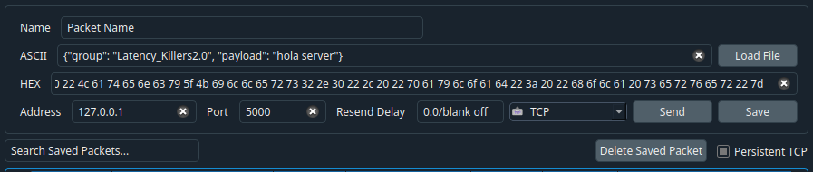
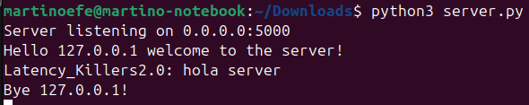
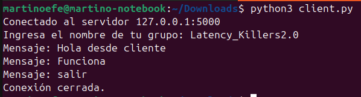
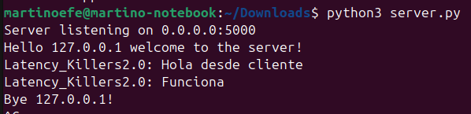
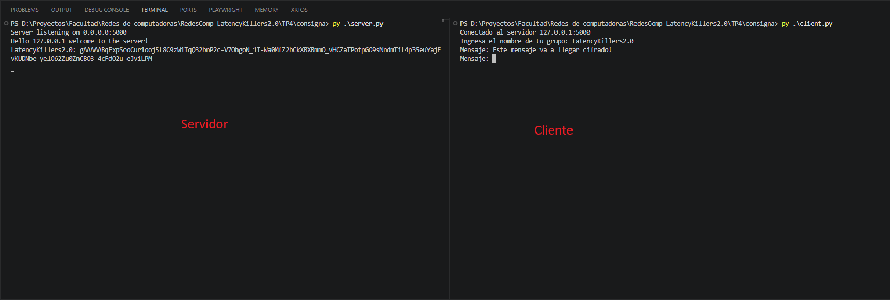
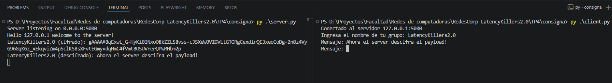
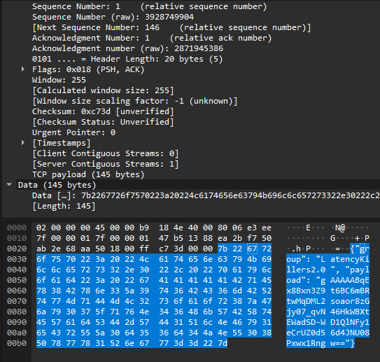

# Trabajo Práctico N°4 – Redes de Computadoras
 
## Integrantes

* Antonino, Tadeo - [tadeo.antonino@mi.unc.edu.ar](mailto:tadeo.antonino@mi.unc.edu.ar)
* Quintana, Ignacio Agustin - [ignacio.agustin.quintana@mi.unc.edu.ar](mailto:ignacio.agustin.quintana@mi.unc.edu.ar)
* Fioramonti, Martino - [martino.fioramonti@mi.unc.edu.ar](mailto:martino.fioramonti@mi.unc.edu.ar)

---
 
## Punto 1 — Serialización en redes de computadoras
 
### a) ¿Qué es la serialización en redes de computadoras?
 
Cuando dos programas se comunican a través de una red, no pueden simplemente "pasarse" un objeto o estructura de datos directamente, ya que cada programa corre en su propio espacio de memoria, posiblemente en máquinas distintas con arquitecturas distintas. Para que la información pueda viajar por la red, necesita ser convertida a una forma transmisible: una secuencia de bytes.
 
**La serialización es el proceso de convertir una estructura de datos (un objeto, un diccionario, una lista, etc.) en una secuencia de bytes o caracteres que pueda ser transmitida por la red, almacenada, y luego reconstruida por quien la recibe.** El proceso inverso —reconstruir la estructura de datos original a partir de los bytes recibidos— se llama **deserialización**.
 
Por ejemplo, si tenemos el siguiente diccionario en Python (ejemplo que se va a utilizar en el punto 2):
 
```python
datos = {
    "group": "Latency_Killers2.0",
    "payload": "hola server"
}
```
 
Este objeto vive en la memoria RAM de nuestra computadora. Para enviarlo por TCP, lo serializamos a texto JSON:
 
```
{"group": "Latency_Killers2.0", "payload": "hola server"}
```
 
Esa cadena de texto puede viajar como bytes a través de la red. Del otro lado, el servidor la recibe y la deserializa, reconstruyendo el diccionario original para poder trabajar con él.
 
Sin serialización, sería imposible que dos programas escritos en distintos lenguajes, corriendo en distintas máquinas, intercambien datos estructurados de forma confiable y estandarizada.
 
---
 
### b) Diferencia entre serialización binaria y no binaria
 
#### Serialización no binaria (basada en texto)
 
Los datos se representan como texto legible por humanos, utilizando caracteres ASCII o UTF-8. Cualquier persona puede abrir el mensaje y entender su contenido sin herramientas especiales.
 
**Ejemplos:**
- **JSON** (JavaScript Object Notation): el formato más utilizado hoy en día en APIs y servicios web.
- **XML** (eXtensible Markup Language): más verboso, ampliamente usado en sistemas empresariales y servicios SOAP.
- **CSV** (Comma-Separated Values): utilizado para datos tabulares simples.
- **YAML**: muy popular en archivos de configuración.
 
**Ventajas:**
- Legible por humanos sin herramientas especiales, lo que facilita enormemente el debugging.
- Interoperable entre prácticamente cualquier lenguaje de programación.
- Fácil de inspeccionar con herramientas como Wireshark o directamente en una terminal.
- Amplio soporte nativo: Python, por ejemplo, incluye el módulo `json` en su librería estándar.

**Desventajas:**
- Ocupa más espacio: el número `1000000` en JSON ocupa 7 bytes como texto, mientras que en binario puro ocuparía solo 4 bytes.
- Más lento de parsear, especialmente con mensajes de gran tamaño.
- Tipos de datos limitados: JSON, por ejemplo, no distingue entre enteros y floats de forma explícita, ni tiene soporte nativo para fechas o datos binarios.
---
 
#### Serialización binaria
 
Los datos se representan directamente en bytes, sin pasar por una representación de texto legible. El formato está diseñado para ser procesado por máquinas de manera eficiente, no para ser leído por humanos.
 
**Ejemplos:**
- **Protocol Buffers (protobuf)**: desarrollado por Google, muy eficiente y con esquema de datos definido explícitamente.
- **MessagePack**: conceptualmente similar a JSON pero representado en binario, mucho más compacto.
- **Apache Avro**: utilizado en ecosistemas de Big Data como Apache Kafka.
- **BSON** (Binary JSON): usado internamente por MongoDB para almacenar documentos.

**Ventajas:**
- Mucho más compacto: menos bytes transmitidos implica menor uso de ancho de banda y menor latencia.
- Más rápido de serializar y deserializar, especialmente en sistemas de alto volumen.
- Permite representar tipos de datos complejos de forma nativa: fechas, números de precisión arbitraria, datos binarios raw, etc.
- Ideal para sistemas con restricciones de rendimiento o ancho de banda: IoT, videojuegos en red, comunicación entre microservicios, etc.

**Desventajas:**
- No es legible por humanos: para inspeccionar un mensaje se necesitan herramientas específicas.
- Más difícil de depurar, ya que los errores no son visibles a simple vista.
- Algunos formatos (como protobuf) requieren un esquema compartido entre cliente y servidor, lo que agrega complejidad al desarrollo y al mantenimiento.
---
 
#### Tabla comparativa
 
| Característica         | No binaria (JSON, XML)         | Binaria (protobuf, MessagePack)                   |
| ---------------------- | ------------------------------ | ------------------------------------------------- |
| Legibilidad humana     | Alta                           | Nula                                              |
| Tamaño del mensaje     | Mayor                          | Menor                                             |
| Velocidad de parsing   | Menor                          | Mayor                                             |
| Facilidad de debugging | Alta                           | Baja                                              |
| Interoperabilidad      | Muy alta                       | Alta (requiere esquema en algunos casos)          |
| Casos de uso típicos   | APIs REST, configuración, logs | Sistemas de alto rendimiento, IoT, microservicios |
 
En el contexto de este trabajo práctico utilizamos **JSON**, un formato de serialización no binaria, por su simplicidad, legibilidad y amplio soporte en Python a través del módulo `json`.

---
 
## Punto 2 — Despliegue del servidor TCP multi-hilo y prueba con PacketSender
 
### ¿Qué es un servidor TCP multi-hilo?
 
El servidor provisto por la cátedra (`server.py`) es un programa Python que escucha conexiones entrantes a través del protocolo TCP. Es **multi-hilo** porque cada vez que un cliente se conecta, el servidor crea un hilo de ejecución nuevo (`threading.Thread`) dedicado exclusivamente a atender a ese cliente. Esto permite que múltiples clientes se conecten y envíen mensajes de forma simultánea sin que se bloqueen entre sí.
 
El servidor espera recibir mensajes serializados en JSON con la siguiente estructura:
 
```json
{
  "group": "<nombre del grupo>",
  "payload": "<mensaje>"
}
```
 
Si el mensaje recibido no tiene exactamente esos dos campos, o no es JSON válido, el servidor lo rechaza mostrando un aviso de mensaje mal formateado.
 
### ¿Qué es PacketSender y para qué lo usamos?
 
PacketSender es una herramienta gráfica que permite enviar paquetes TCP y UDP de forma manual, sin necesidad de escribir un cliente. Lo usamos en este punto para verificar que el servidor funciona correctamente antes de programar nuestro propio cliente en el Punto 3. Es útil para hacer pruebas rápidas y depurar el comportamiento del servidor de forma aislada.
 
En Linux se utiliza como un AppImage, que es un formato de distribución de aplicaciones que no requiere instalación: simplemente se le dan permisos de ejecución y se corre directamente.
 
### Procedimiento realizado
 
**1. Ejecución del servidor**
 
Se ejecutó el script `server.py` desde la terminal con el comando:
 
```bash
python3 server.py
```
 
El servidor quedó escuchando conexiones entrantes en todas las interfaces de red (`0.0.0.0`) en el puerto `5000`, mostrando el siguiente mensaje de confirmación:
 
```
Server listening on 0.0.0.0:5000
```
 
**2. Configuración y envío desde PacketSender**
 
Se abrió PacketSender y se configuraron los siguientes parámetros:


 
- **Address:** `127.0.0.1` — la dirección loopback, que representa la propia máquina. Al ser cliente y servidor en la misma computadora, usamos esta dirección para que el paquete no salga a la red sino que se dirija localmente.
- **Port:** `5000` — el mismo puerto en el que el servidor está escuchando.
- **Protocolo:** `TCP`
- **Campo ASCII:** el mensaje JSON con el formato que el servidor espera:
```
{"group": "Latency_Killers2.0", "payload": "hola server"}
```
 
- Se activó la opción **Persistent TCP** para mantener la conexión abierta entre envíos, evitando que se abra y cierre una conexión TCP nueva en cada mensaje.
Luego se clickeó **Send**.
 
**3. Verificación en el servidor**
 
Al recibir el mensaje, el servidor mostró en la terminal:
 

 
Esto confirma que:
- La conexión TCP fue establecida correctamente.
- El mensaje JSON fue recibido y deserializado sin errores.
- Los campos `group` y `payload` fueron extraídos e impresos correctamente.
- Al cerrar la conexión desde PacketSender, el servidor detectó la desconexión y cerró el hilo correspondiente.
 
## Punto 3 — Cliente TCP con serialización JSON
 
### ¿Que se hizo?
 
El cliente provisto por la cátedra tenía dos problemas: enviaba un mensaje hardcodeado con campos incorrectos (`nombre` y `que_digo`) que el servidor no reconoce, y se cerraba inmediatamente después de enviarlo. El objetivo de este punto es modificarlo para que sea interactivo y serialice los mensajes en el formato correcto que el servidor espera.
 
### Modificaciones realizadas al cliente
 
El cliente final cumple con los tres requisitos del punto:
 
**a) Configuración de IP y puerto**
 
La IP y el puerto del servidor se definen al inicio del script y se usan para establecer la conexión TCP:
 
```python
HOST = "127.0.0.1"
PORT = 5000
 
client = socket.socket(socket.AF_INET, socket.SOCK_STREAM)
client.connect((HOST, PORT))
```
 
Se usa `127.0.0.1` porque cliente y servidor corren en la misma máquina. En un escenario real se reemplazaría por la IP del servidor remoto.
 
**b) Serialización en el formato correcto**
 
Antes de enviar cada mensaje, se construye un diccionario Python con los campos `group` y `payload` que el servidor espera, y se serializa a JSON con `json.dumps()`. Luego se codifica a bytes UTF-8 para poder transmitirlo por el socket:
 
```python
message = {
    "group": GROUP,
    "payload": payload
}
client.sendall(json.dumps(message).encode("utf-8"))
```
 
**c) Consola interactiva**
 
El cliente entra en un loop que le pide al usuario un mensaje por consola en cada iteración. El loop continúa hasta que el usuario escribe `salir` o interrumpe con `Ctrl+C`:
 
```python
while True:
    payload = input("Mensaje: ")
    if payload.lower() == "salir":
        break
```
 
### Código completo del cliente
 
```python
import socket
import json
 
HOST = "127.0.0.1"
PORT = 5000
 
client = socket.socket(socket.AF_INET, socket.SOCK_STREAM)
client.connect((HOST, PORT))
print(f"Conectado al servidor {HOST}:{PORT}")
 
GROUP = input("Ingresa el nombre de tu grupo: ")
 
try:
    while True:
        payload = input("Mensaje: ")
        if payload.lower() == "salir":
            break
 
        message = {
            "group": GROUP,
            "payload": payload
        }
 
        client.sendall(json.dumps(message).encode("utf-8"))
 
except KeyboardInterrupt:
    print("\nCerrando cliente...")
 
finally:
    client.close()
    print("Conexión cerrada.")
```
 
### Procedimiento realizado
 
Se abrieron dos terminales. En la primera se ejecutó el servidor:
 
```bash
python3 server.py
```
 
En la segunda se ejecutó el cliente:
 
```bash
python3 client.py
```
 
El cliente solicitó el nombre del grupo y luego permitió enviar mensajes de forma continua. Cada mensaje fue serializado a JSON y enviado al servidor por TCP. Al escribir `salir`, el cliente cerró la conexión correctamente.
 
### Verificación
 
En la terminal del servidor se pudo observar la recepción correcta de cada mensaje enviado desde el cliente, confirmando que la serialización y la transmisión funcionaron correctamente.
 
### Capturas de pantalla
 
**Captura 1 — Terminal del cliente enviando mensajes:**
 

 
**Captura 2 — Terminal del servidor recibiendo los mensajes:**
 



## Punto 4 — Cifrado de la payload del mensaje

En este punto se incorporó una técnica de seguridad al sistema cliente-servidor desarrollado anteriormente.  
La consigna solicita cifrar únicamente la carga útil del mensaje, es decir, el campo `payload`, manteniendo visible el resto de la estructura JSON.

El mensaje original tenía la siguiente forma:

```json
{
  "group": "Latency_Killers2.0",
  "payload": "hola servidor"
}
```
Luego de implementar el cifrado, el mensaje enviado conserva el mismo formato general, pero el contenido de payload viaja cifrado:

```json
{
  "group": "Latency_Killers2.0",
  "payload": "gAAAAABpJx9J..."
}
```
De esta forma, el servidor sigue pudiendo interpretar el JSON y reconocer el grupo emisor, pero no puede leer directamente el contenido real del mensaje si no posee la clave correspondiente.

### Técnica de cifrado utilizada

Para cifrar la payload se utilizó Fernet, una implementación de cifrado simétrico provista por la librería `cryptography` de Python.
Fernet permite cifrar y descifrar mensajes utilizando una misma clave secreta. Esto significa que tanto el cliente como el servidor deben conocer la misma clave para poder trabajar con los datos cifrados.
En este punto solo se implementó el cifrado del lado del cliente, por lo que el servidor recibe la carga útil cifrada y la muestra tal como llega.

### ¿Qué es el cifrado simétrico?

El cifrado simétrico es una técnica de criptografía en la que se utiliza la misma clave tanto para cifrar como para descifrar la información.

El funcionamiento general es el siguiente:

1. El emisor toma el mensaje original.
2. Usa una clave secreta para cifrarlo.
3. Envía el mensaje cifrado por la red.
4. El receptor necesita la misma clave para poder descifrarlo.

En nuestro caso:

- El cliente toma el texto ingresado por consola.
- Cifra ese texto usando Fernet.
- Coloca el resultado cifrado dentro del campo payload.
- Envía el JSON serializado por TCP al servidor.


### ¿Por qué se eligió Fernet?

Se eligió Fernet porque es una opción simple, segura y fácil de implementar para este tipo de práctica.

Sus principales características son:

- Utiliza cifrado simétrico.
- Genera un resultado cifrado en formato de texto, fácil de incluir dentro de un JSON.
- Permite verificar que el mensaje no haya sido modificado.
- Incluye información interna para evitar que el mismo mensaje produzca siempre exactamente la misma salida cifrada.
- Es sencilla de usar desde Python mediante la librería `cryptography`.

Esto la hace adecuada para este trabajo práctico, ya que permite demostrar claramente que el contenido de la payload viaja cifrado sin modificar el funcionamiento general del protocolo TCP ni la estructura JSON definida por la consigna.


### Instalación de la librería

Para utilizar Fernet fue necesario instalar la librería `cryptography`:

```bash
pip install cryptography
```
Esta librería contiene herramientas criptográficas para Python, entre ellas el módulo `Fernet`.


### Generación de la clave secreta

Luego se generó una clave secreta utilizando el siguiente comando:

```bash
python -c "from cryptography.fernet import Fernet; open('secret.key', 'wb').write(Fernet.generate_key())"
```

Este comando crea un archivo llamado:
```bash
secret.key
```

Dentro de ese archivo se guarda la clave que será utilizada para cifrar los mensajes.

La clave se genera una sola vez y luego se reutiliza cada vez que el cliente necesita cifrar un mensaje.


### Implementación en el cliente

Primero se importó Fernet desde la librería cryptography:

```bash
from cryptography.fernet import Fernet
```

Luego se cargó la clave secreta desde el archivo secret.key:
```bash
with open("secret.key", "rb") as key_file:
    key = key_file.read()

fernet = Fernet(key)
```


Esto permite crear un objeto fernet encargado de cifrar la información.

Dentro del loop principal del cliente, antes de enviar el mensaje al servidor, se cifró únicamente el contenido de payload:
```bash
payload_cifrada = fernet.encrypt(payload.encode("utf-8")).decode("utf-8")
```

En esta línea ocurren tres pasos:

1. `payload.encode("utf-8")`: convierte el texto ingresado por el usuario a bytes.
2. `fernet.encrypt(...)`: cifra esos bytes usando la clave secreta.
3. `.decode("utf-8")`: convierte el resultado cifrado nuevamente a texto para poder incluirlo dentro del JSON.

Luego se construyó el mensaje manteniendo visible el campo group, pero colocando la payload cifrada:

```python
message = {
    "group": GROUP,
    "payload": payload_cifrada
}
```

Finalmente, el mensaje se serializó a JSON y se envió por TCP:
```python
client.sendall(json.dumps(message).encode("utf-8"))
```

El resultado obtenido fue el esperado. Del lado del cliente se ingresa un payload son cifrar y al llegar al servidor esta ya cifrado.



Como se puede ver en la imagen, del lado del cliente el mensaje sale sin cifrar, pero luego al enviarse y llegar al servido, este llega cifrado.


## Punto 5 - Descifrado del lado del Servidor
En este punto modificamos el servidor para que sea capaz de descifrar la `payload` enviada por el cliente.

Como la técnica de cifrado utilizada es **simétrica**, el servidor necesita utilizar la misma clave secreta que usó el cliente para cifrar el mensaje. En este caso, como cliente y servidor se ejecutan en la misma computadora, ambos pueden acceder al mismo archivo `secret.key`.

De esta forma, el mensaje sigue viajando cifrado por la red, pero una vez que llega al servidor, este puede recuperar el contenido original de la carga útil.

Para ello, modificamos tambien el codigo del server. Siguiendo los mismos pasos que hicimos para cifrar, unicamente que esta vez desciframos el mensaje.



Como podemos ver, ahora el server puede descifrar el mensaje enviado por el cliente. Obteniendo asi, su contenido original.




En la captura se puede observar que el mensaje enviado mantiene la estructura JSON esperada, pero el campo `payload` no contiene el texto original, sino una cadena cifrada generada por `Fernet`.

Esto permite comprobar que la carga útil del mensaje viaja cifrada a través de la red. Es decir, si alguien interceptara el tráfico, podría ver que se envió un JSON con los campos `group` y `payload`, pero no podría conocer el contenido real del mensaje sin poseer la clave secreta.

Al mismo tiempo, como el servidor sí posee la misma clave `secret.key`, puede descifrar correctamente la payload recibida y mostrar el mensaje original en consola.