# Trabajo Práctico N°5 – Redes de Computadoras
 
## Integrantes

* Antonino, Tadeo - [tadeo.antonino@mi.unc.edu.ar](mailto:tadeo.antonino@mi.unc.edu.ar)
* Quintana, Ignacio Agustin - [ignacio.agustin.quintana@mi.unc.edu.ar](mailto:ignacio.agustin.quintana@mi.unc.edu.ar)
* Fioramonti, Martino - [martino.fioramonti@mi.unc.edu.ar](mailto:martino.fioramonti@mi.unc.edu.ar)

---

## 1) Reconocimiento de arquitectura 

-Firewall: Es la primera línea de defensa. Su función es bloquear el tráfico malicioso. Se ubica entre la capa de Internet y la capa de Transporte (puede subir a la capa de Aplicación). Si faltara, el tráfico malicioso saturaría instantáneamente los recursos de los servidores, provocando una caída total por ataques DDoS.

-Load Balancer: Se encarga de distribuir el tráfico a múltiples instancias de cómputo. Opera en la capa de Transporte o en la capa de Aplicación. Si faltara, todo el tráfico caería sobre un único servidor, no se podría escalar horizontalmente y el sistema colapsaría.

-Queue: Son buffers que previenen caídas durante sobrecargas o picos. Pertenece a la capa de Aplicación. Si faltara, los picos repentinos de tráfico saturarían los hilos de ejecución de los servidores, generando errores de timeout y fallas por sobrecarga.

-Compute: Nodo. Solicita procesos. Se encuentra en la capa de Aplicación. Si faltara, la arquitectura carecería de capacidad de cómputo, no existiría un entorno para ejecutar el código ni procesar la lógica de negocio.

-Serverless Function: Escala automáticamente con el tráfico. Es de bajo mantenimiento aunque tiene alto costo por proceso completado. Está situado en la capa de Aplicación. Si faltara, se perdería la capacidad de absorber ráfagas masivas de eventos aislados de forma inmediata sin pagar por servidores encendidos las 24 horas.

-SQL DB: Base de datos que opera como destino para tráfico de READ/WRITE/SEARCH. Corresponde a la capa de Aplicación. Si faltara, no habría un sistema centralizado, persistente y relacional para garantizar la consistencia de los datos críticos y las transacciones.

-NoSQL: Base de datos más rápida para READ/WRITE pero que no puede manejar SEARCH. Se localiza en la capa de Aplicación. Si faltara, las operaciones masivas de READ/WRITE rápida sobrecargarían la base de datos relacional principal, ralentizando todo el sitio.

-Cache: Se usa para bajar la carga de las DB. Se posiciona en la capa de Aplicación. Si faltara, cada consulta idéntica impactaría en los discos de las bases de datos, degradando severamente el tiempo de respuesta del sistema bajo uso concurrente.

-CDN: Content Delivery Network. Procesa el tráfico del tipo STATIC. Se clasifica dentro de la capa de Aplicación. Si faltara, el tráfico estático inundaría los servidores de backend, consumiendo su CPU y ancho de banda innecesariamente en entregar simples imágenes.

-Storage: Es el destino del tráfico del tipo STATIC/UPLOAD. Está asignado a la capa de Aplicación. Si faltara, los archivos subidos por los usuarios llenarían rápidamente el disco local del servidor de aplicación, provocando que el sistema operativo falle por falta de espacio.

-Search Engine: Alternativa a una SQL DB para procesar peticiones SEARCH de manera más rápida. Se integra en la capa de Aplicación. Si faltara, las búsquedas complejas por texto requerirían consultas SQL extremadamente pesadas, indexando tablas enteras y congelando la base de datos.

-Réplica: Descarga tráfico READ de la DB maestra. Hace su trabajo en la capa de Aplicación. Si faltara, todo el tráfico de consulta golpearía al nodo maestro de la base de datos, bloqueando las operaciones de escritura y pausando la aplicación.

Es importante destacar que muchos de los componentes operan en la capa de Aplicación porque el propósito de las capas inferiores en el modelo TCP/IP es mover paquetes de datos de un punto A a un punto B de forma segura y confiable, sin importar qué contienen esos paquetes adentro.

A la capa de Internet (IP) solo le importa la dirección de destino.

A la capa de Transporte (TCP) solo le importa que los paquetes lleguen completos y en orden usando puertos.

Una vez que TCP cumplió su trabajo y ordenó los paquetes, se los entrega al sistema operativo. A partir de ahí todo lo que sucede con esos datos es tarea exclusiva de la capa de Aplicación.

---

## 2) Tipos de Tráfico

| Tipo de tráfico | Ejemplo real | Componente recomendado | Riesgo si se procesa incorrectamente |
| --- | --- | --- | --- |
| **STATIC** | Archivos CSS de estilos, logotipos o imágenes de la interfaz, y scripts fijos de JavaScript. | **CDN** o **Storage** | Desperdicio innecesario de la capacidad de cómputo del servidor de aplicaciones (*Compute*), aumentando costos y ralentizando la carga general del sitio. |
| **READ** | Consultar el perfil público de un usuario, listar los productos disponibles en una tienda o leer un artículo de noticias. | **Cache** (para datos frecuentes) y **Réplicas de lectura** de la base de datos. | Saturación y cuello de botella en los discos de la base de datos principal, provocando demoras extremas en todas las consultas del sistema. |
| **WRITE** | Registrar un nuevo usuario, realizar una compra en el carrito, publicar un comentario o actualizar una contraseña. | **SQL DB** o **NoSQL DB** (según la estructura). | Pérdida de datos transaccionales críticos del negocio, inconsistencias en el sistema o bloqueos concurrentes en las tablas de almacenamiento. |
| **UPLOAD** | Subir una foto de perfil en formato JPG, adjuntar un documento PDF para una tarea o cargar un archivo de video. | **Storage** (Almacenamiento de objetos). | Llenado rápido del disco de almacenamiento local del servidor de aplicaciones, provocando fallas imprevistas y el colapso del sistema operativo. |
| **SEARCH** | Buscar un artículo escribiendo palabras clave en la barra de búsqueda (ej: "zapatillas deportivas impermeables"). | **Search Engine** dedicado. | Ejecución de consultas de texto (*queries*) sumamente ineficientes en la base de datos relacional, forzando escaneos completos de tablas que congelan el servicio. |
| **MALICIOUS** | Ataques de denegación de servicio distribuido (DDoS), escaneos automatizados de vulnerabilidades o inyecciones de código. | **Firewall** | Consumo total e inmediato del ancho de banda y de los hilos de procesamiento, dejando la infraestructura completamente inaccesible para los usuarios legítimos. |

---

## 3) Test de Queues

Al aumentar fuertemente el traffic rate notamos que luego de la queue la cantidad de "bolitas" disminuye drásticamente, lo cual es acorde a la función de la queue que, como se mencionó antes, opera como buffer.

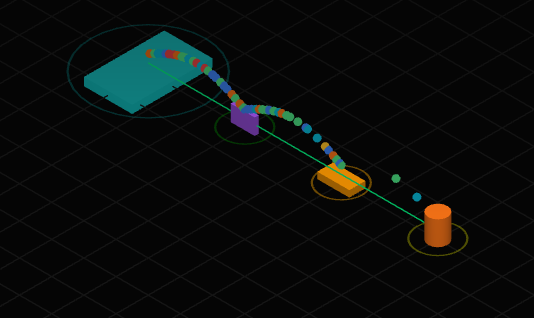

Luego si bajamos el traffic rate a 0 instantáneamente observamos como desde la queue hacia la compute solo pasa el tráfico remanente que quedó buffereado antes.

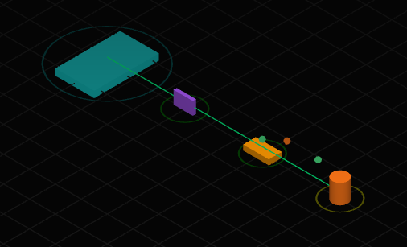

---

## 4) Infraestructura mínima

Armamos una infraestructura mínima que consta de un firewall para controlar el tráfico `MALICIOUS`, un load balancer (en realidad como usamos un solo compute no lo queríamos poner, pero no nos deja pasar del firewall directamente a compute), un compute, una CDN que procesa el tráfico `STATIC`, un storage para `UPLOADS` y `STATIC`, un search para `SEARCH` (valga la redundancia), y una NoSQL para las `READ/WRITE`.

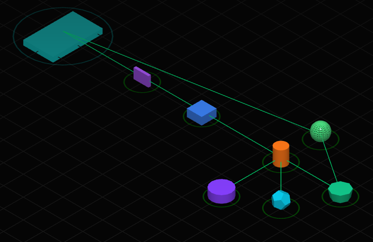

De este modo, comenzamos con el siguiente presupuesto:

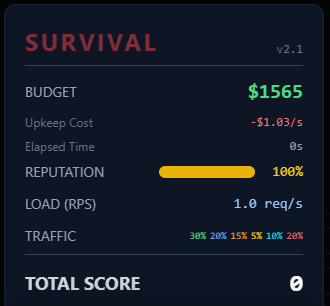

Al comenzar la simulación con una bajo traffic rate se puede observar que la infraestructura es capaz de soportar la carga, como se ve en la imagen:

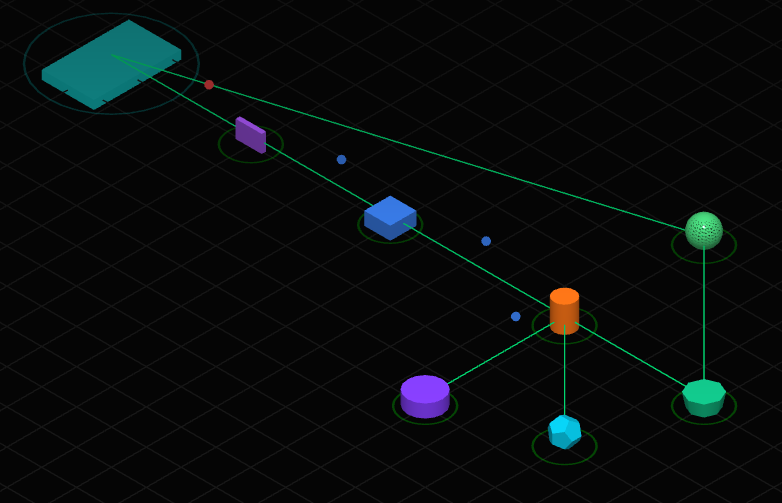

Además, el estado de salud de los servicios se mantiene alto:

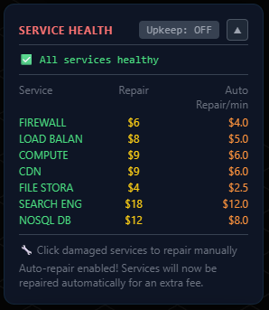

Luego de aumentar el traffic rate a valores muy altos pudimos ver como el nodo compute colapsa, haciendo caer nuestra reputación casi al instante, como se puede observar en la imagen siguiente:

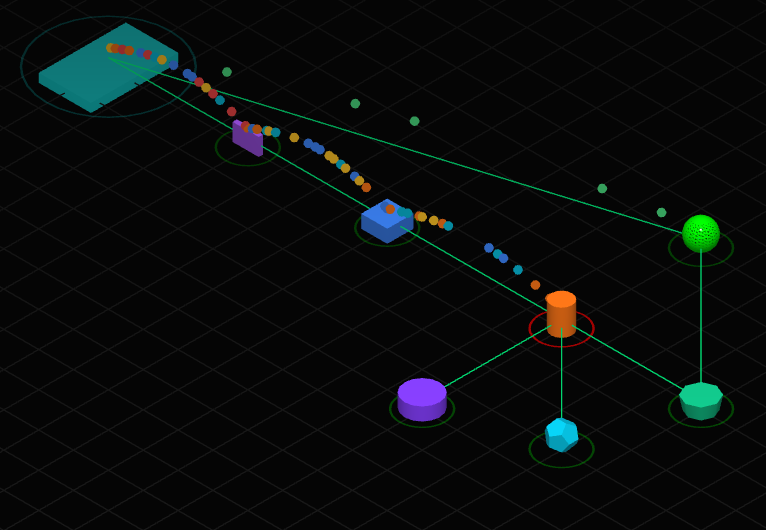

Y la baja reputación:

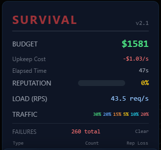

Entonces ¿Que sucedió realmente?

Al desarrollar una infraestructura sin mecanismos de optimización y desacoplamiento para el tráfico dinámico transaccional tales como queues o cachés, el aumento repentino del traffic rate hace colapsar el sistema, en particular el nodo compute, que no puede procesar tantas solicitudes tan rápido, llegando al 100% de sus capacidades rápidamente. 

Esto es claramente un problema de diseño, el núcleo dinámico de la red colapsó debido a una topología centralizada y síncrona.

---

## 5) Escalabilidad y balanceo

Para solucionar los problemas ocasionados por las fallas de diseño en la arquitectura del apartado anterior, probaremos las siguientes estrategias:

    -Agregar más capacidad de cómputo.
    -Agregar caché.
    -Agregar cola de mensajes. 
    -Separar servicios según tipo de tráfico. 

Estas estrategias contemplan formas de escalabilidad horizontal, como el hecho de agregar mas nodo compute, y también mejoran el balanceo de cargas como al hacer una separación de servicios según el tipo de tráfico.

Comenzamos solamente agregando más capacidad de cómputo y observamos que sucede.

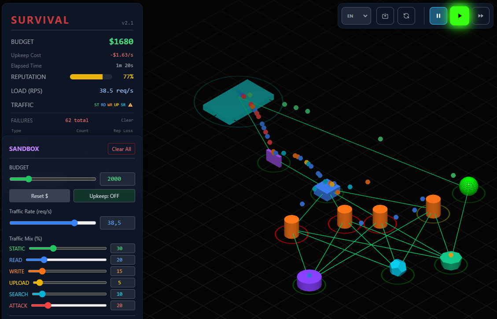

Como podemos observar, escalar horizontalmente la capacidad de computo es de gran ayuda para poder procesar más tráfico a la vez, pero no es suficiente. Luego de un tiempo vemos como el sistema comienza a fallar o retrasarse en las resquets, haciendo que nuestra reputación comience a bajar.

Pasemos entonces a ver que sucede cuando agregamos una caché.

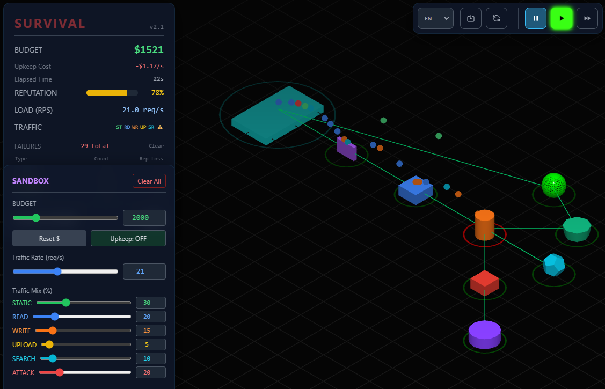

Al agregar una caché que ayude al tráfico de `READ/WRITE` dirigido hacia la NoSQL, vemos que la infraestructura colapsa incluso con un traffic rate no especialmente alto, por lo que podemos suponer que el cuello de botella se encuentra en la sección anterior, el nodo de cómputo.

Siguiendo con las estrategias, probaremos ahora añadir una cola de mensajes que sirva de buffer para el nodo de cómputo. La arquitectura ahora se ve de la siguiente manera:

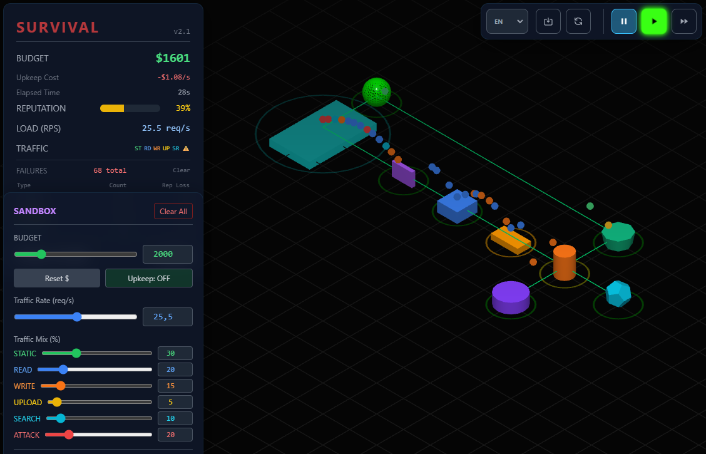

Lo que observamos en la imagen es que la cola de mensajes ayuda hasta cierto punto a que el nodo cómputo trabaje más eficientemente, pero al subir el traffic rate vemos como otra vez esta mejora por sí sola no es suficiente.

Veremos ahora que sucede si diseñamos una arquitectura que separe los servicios según el tipo de tráfico que procesan. Para ello, nuestra infraestructura constará de tres "líneas" de tráfico: la primera se encargará del tráfico de  `READ/WRITE`, la segunda del tráfico `SEARCH` y, por último, la tercera se encargará del tráfico `UPLOADS` y `STATIC`.

El elemento clave detrás de esta arquitectura es el `API Gateway` que nos permite diferenciar los tipos de tráfico que entran en cada cola de mensajes. Sin este elemento, no habría quién diga "vos sos un `SEARCH` entonces vas a esta cola, vos sos un `UPLOAD` vas a esta otra".

Probamos entonces la nueva arquitectura.

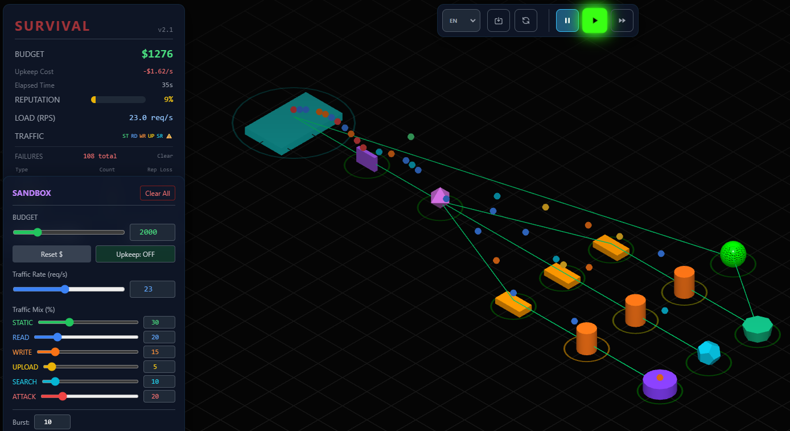

Para nuestra sorpresa, esta arquitectura falla rápidamente incluso con bajos traffics rates, como podemos ver en la imagen.

Podemos concluir luego de probar diferentes estrategias, que no hay una única estrategia salvadora. Para lograr una infraestructura robusta se necesita escalar tanto horizontal como verticalmente. De las pruebas que realizamos, la que mejor rendimiento obtuvo fue la primera en la cual escalamos horizontalmente la capacidad de cómputo y el sistema respondió de buena manera hasta que aumentamos el traffic rate a valores muy altos. Ninguna de las demás estrategias obtuvo rendimientos similares a ese. Por ese motivo creemos que el escalamiento horizontal es clave y mejora notablemente los sistemas, aunque no es suficiente por sí solo. Se necesita mejorar los elementos y además agregar mecanismos como colas, cachés y réplicas que ayuden al procesamiento del tráfico.